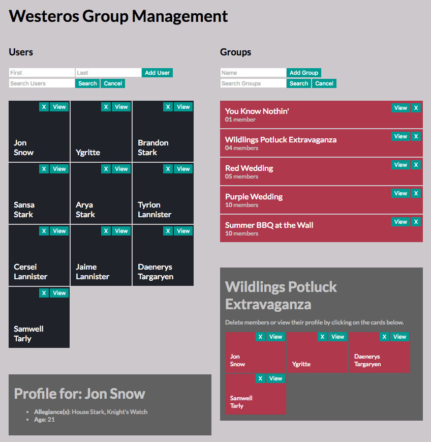
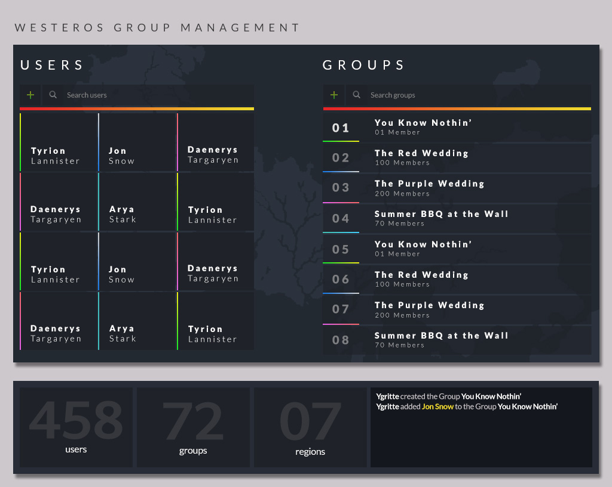

# React/Redux User Management Demo

> A User Management application demo written in React and Redux

This is a work-in-progress sample User Management Application built to hone my skills with React and Redux. This application
is comically-themed with data from [Game of Thrones](https://en.wikipedia.org/wiki/Game_of_Thrones), because Lorem Ipsum isn't much fun.
 Over time I will build in new features as I focus on different React development techniques, tooling, and best practices.
This is very much a work in progress, and has a few bumps and bruises. Pull requests welcome!

## Features

- [x] Create a user
- [x] Delete a user
- [x] Create a group
- [x] Delete a group
- [x] Add users to groups (via drag-n-drop)
- [x] Remove users from group
- [x] Search users
- [x] Search groups
- [x] View user profile
- [x] List groups members

## Tools

Here are a few of the highlighted technologies used in this project, as well as a few anticipated technologies
that will work their way into this project in the future:

- [x] React
- [x] Redux
- [x] redux-thunk
- [x] redux-logger
- [x] reselect
- [x] Drag and Drop features (via react-dnd)
- [ ] Jest
- [ ] Redux Saga (or redux-loop)

## The Future

I spent some time designing a more interesting Interface, as well as some interesting features like a
console messaging system (which could be implemented with some redux middleware), and I eventually want
to make the entire inteface support drag and drop behaviors.

## License

MIT